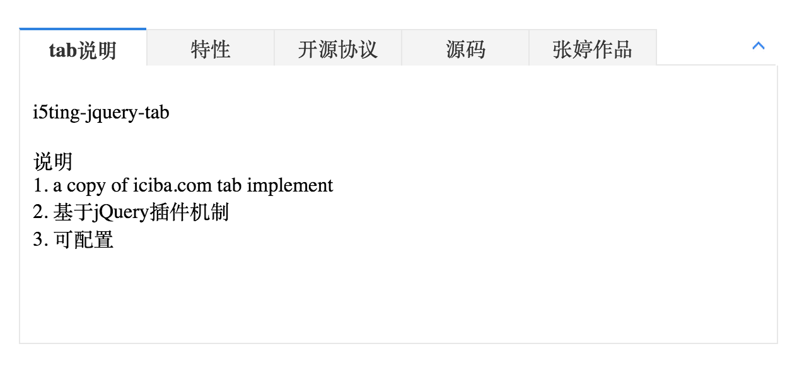

# i5ting.react.tab

i5ting.react.tab是基于[i5ting.jquery.tab](https://github.com/i5ting/i5ting.jquery.tab)使用reactjs重写的tab模块。

[](http://badge.fury.io/js/i5ting.react.tab)



## Install

    npm install --save i5ting.react.tab

## 模板

```
<!DOCTYPE html>
<html>
<head>
    <title>i5ting-react-tab example</title>
    <meta http-equiv="Content-Type" content="text/html; charset=utf-8" />
    <!-- include react -->
    <script src="./node_modules/react/dist/react-with-addons.js"></script>
    <!-- The core React library -->
    <!-- In-browser JSX transformer, remove when pre-compiling JSX. -->
    <script src="./node_modules/react/dist/JSXTransformer.js"></script>
    <style type="text/css">
    	*{margin:0; padding:0;}
	
    	.wrap1{width:600px; margin:0 auto;}
    	.wrap2{width:600px; margin:0 auto;}
    	.wrap3{width:600px; margin:0 auto;}
 	
    	.wrap3 .i5ting_tab_header_bg{
    		background-color :#f4f4f4;
    	}
    </style>
    <link href="./node_modules/i5ting.react.tab/i5ting-jquery-tab.css" media="screen" rel="stylesheet" type="text/css">
</head>
<body>
    <div id="wrap1">
        <!-- this is where the root react component will get rendered -->
    </div>
    <script src="./node_modules/i5ting.react.tab/libs/jquery/jquery.js" type="text/javascript"></script>
    <script type="text/jsx" src="./dist/bundle.js"></script>
</body>
</html>
```

说明（以下2个文件是必须引用的）：

    <link href="./node_modules/i5ting.react.tab/i5ting-jquery-tab.css" media="screen" rel="stylesheet" type="text/css">
    <script src="./node_modules/i5ting.react.tab/libs/jquery/jquery.js" type="text/javascript"></script>
    
## 用法

tab_test.jsx

```
var i5ting    = require('i5ting.react.tab');
var Tab       = i5ting.Tab;
var TabItem   = i5ting.TabItem;

var callback = function(key){
  alert(key);
}

React.render(
  <Tab tab_changed={callback}>
    <TabItem title="tab说明" current>
      <p>tab说明</p>
    </TabItem>
    <TabItem title="'特性'">
      特性
    </TabItem>
    <TabItem title="开源协议">
      开源协议
    </TabItem>
    <TabItem title="源码">
      源码
    </TabItem>
    <TabItem title="张婷作品">
      <p>张婷作品</p>
    </TabItem>
  </Tab>
  ,
  document.getElementById('wrap1')
);
```

说明`./dist/bundle.js`是`tab_test.jsx`作为入口文件，使用webpack生成的最终文件

## Contributing

1. Fork it
2. Create your feature branch (`git checkout -b my-new-feature`)
3. Commit your changes (`git commit -am 'Add some feature'`)
4. Push to the branch (`git push origin my-new-feature`)
5. Create new Pull Request

## 版本历史


- v1.1.0 实现tab_changed callback(见tag)
- v1.0.0 初始化版本

## 欢迎fork和反馈

- write by `i5ting` shiren1118@126.com

如有建议或意见，请在issue提问或邮件

## License

this repo is released under the [MIT
License](http://www.opensource.org/licenses/MIT).
